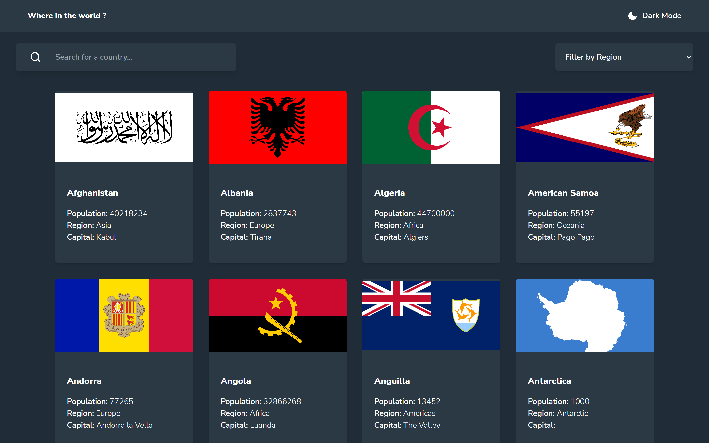
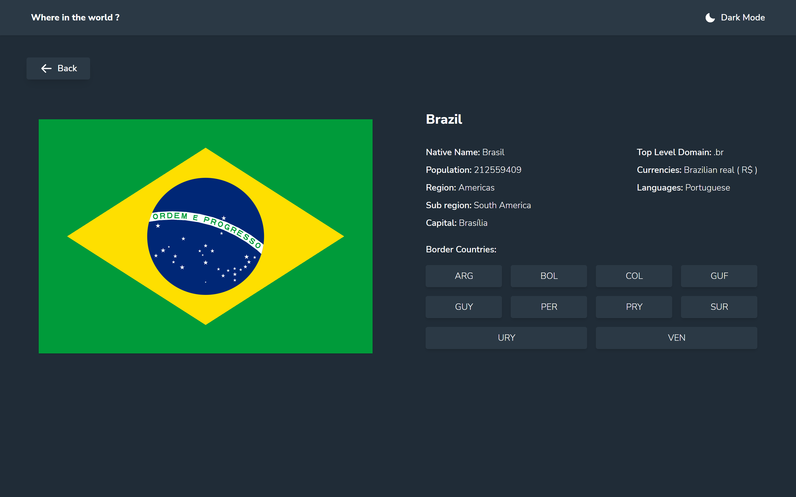
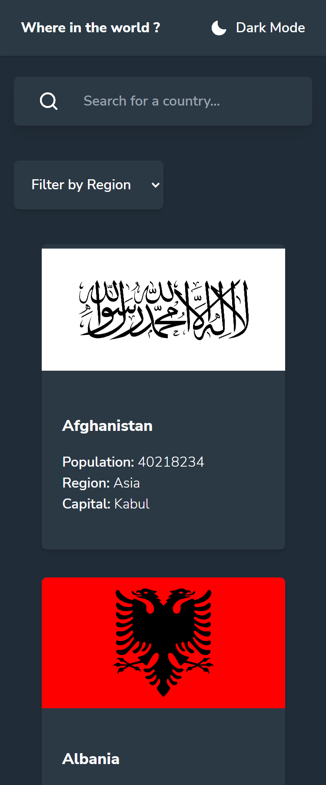
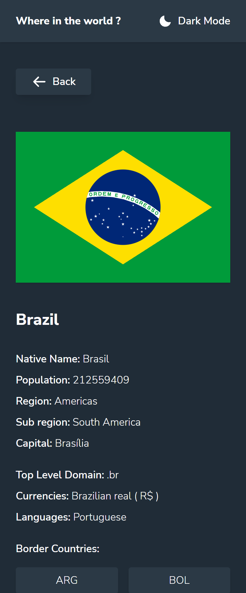

# Frontend Mentor - REST Countries API

Esta é uma solução para o [REST Countries API with color theme switcher](https://www.frontendmentor.io/challenges/rest-countries-api-with-color-theme-switcher-5cacc469fec04111f7b848ca).

## Screenshots




<p align="center">

</p>
<p align="center">

</p>

## Links

Link: https://countries-api-react-five.vercel.app/

## Aprendizados

-  Treino de Typescript com resposta da API e ContextAPI.
-  Custom Hook de theme switcher usando TailwindCSS.
-  Filtragem por texto e menu.

## Construído com

-   React
-   Typescript
-   Tailwind
-   React-router-dom
-   ContextAPI
-   Phosphor-react Icons

## Executando o projeto

Pelo seu terminal navegue até a pasta do projeto e execute:

```cl
  npm install
  npm run dev
```

## Autores

-   [@Mveryy](https://github.com/Mveryy)
